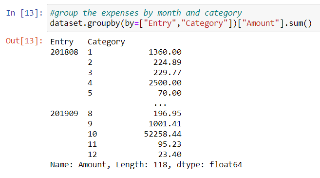
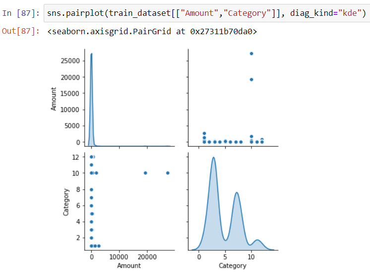
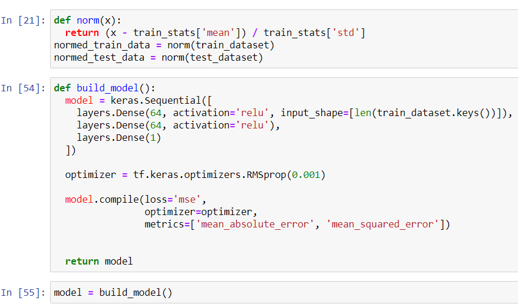
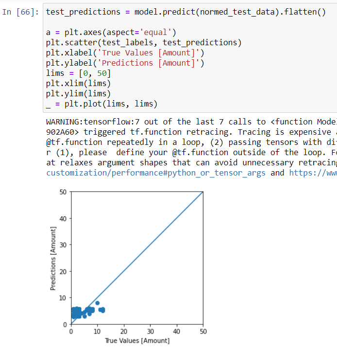
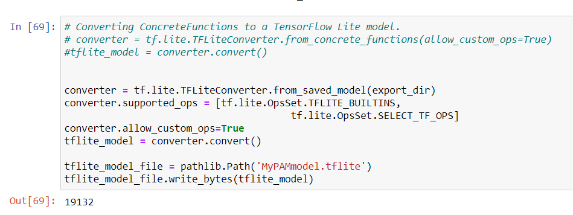

# Android-with-Machine-Learning
Personal Finances App using Android and Tensorflow Lite
Demo

 Drawer menu, Homepage with expenses graph, and Entries manager page 
 

  
  
  

 
2. Grouping data by month and category

     

3. Verifying the distribution of the training dataset

     

4. Building the model

     

5. Plotting the predictions against the true values to check the model

     

6. Converting the Tensorflow model to Tensorflow Lite

     

