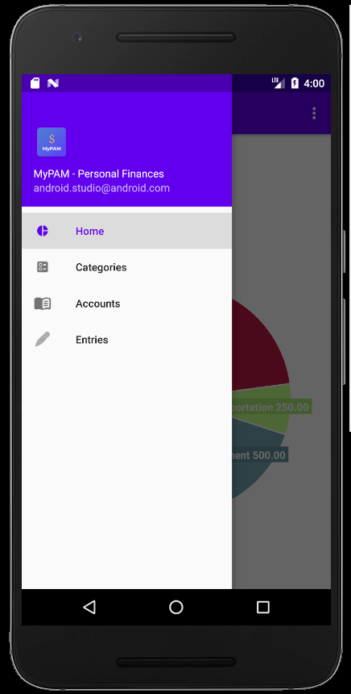
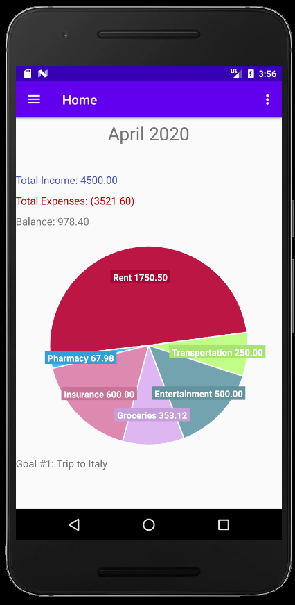
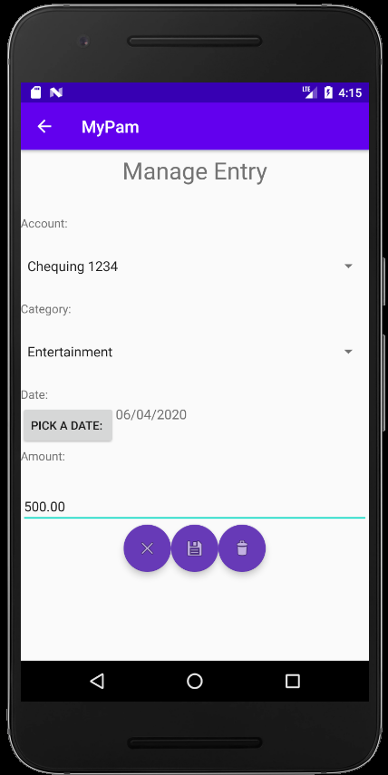

# Android-with-Machine-Learning
Personal Finances App using Android and Tensorflow Lite
Demo

Drawer menu, Homepage with expenses graph, and Entries manager page 

  
    
      

Machine Learning Model
